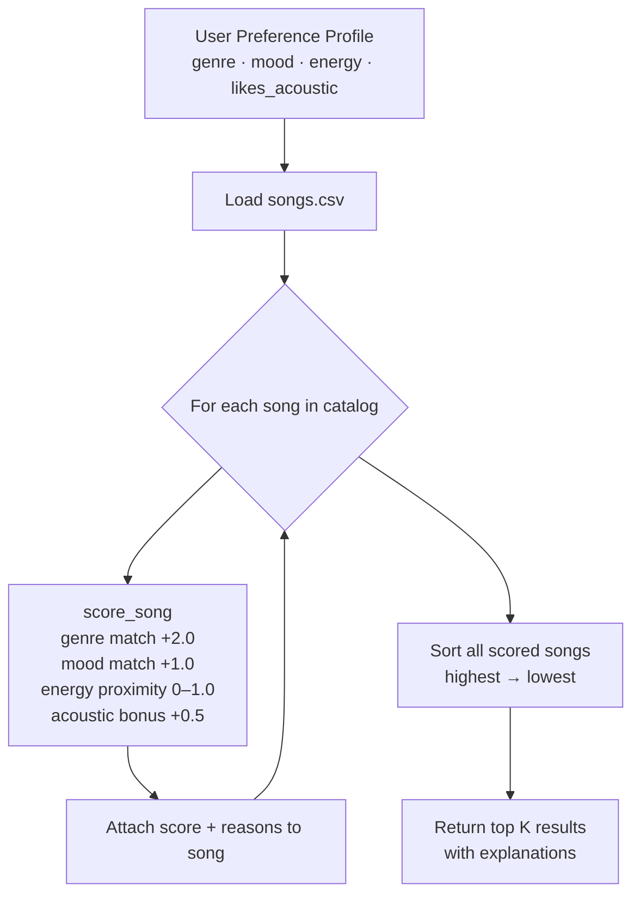

# Music Recommender Simulation

## Project Summary

This project simulates a content-based music recommendation system. Given a user's taste profile (preferred genre, mood, and energy level), the system scores every song in a catalog and returns the top matches. It mirrors how real platforms like Spotify surface music using song attributes rather than crowd behavior, making the logic transparent and easy to inspect.

---

## How The System Works

Real-world platforms like Spotify combine two main approaches: **collaborative filtering** (recommending songs that similar users enjoyed) and **content-based filtering** (recommending songs whose attributes match what you already like). This simulation focuses on content-based filtering because it only requires song metadata — no user history needed.

**Features each `Song` uses:**
- `genre` — categorical label (pop, lofi, rock, etc.)
- `mood` — emotional tone (happy, chill, intense, etc.)
- `energy` — float 0.0–1.0, how loud/active the track feels
- `tempo_bpm` — beats per minute
- `valence` — float 0.0–1.0, musical positivity
- `danceability` — float 0.0–1.0, how suitable for dancing
- `acousticness` — float 0.0–1.0, how acoustic vs. electronic

**What the `UserProfile` stores:**
- `favorite_genre` — the genre to match first
- `favorite_mood` — preferred emotional tone
- `target_energy` — ideal energy level (0.0–1.0)
- `likes_acoustic` — boolean preference for acoustic tracks

**Algorithm Recipe (scoring one song):**

| Rule | Points |
|------|--------|
| Genre matches user preference | +2.0 |
| Mood matches user preference | +1.0 |
| Energy proximity: `1.0 - abs(song_energy - target_energy)` | 0.0–1.0 |
| Acoustic bonus (if `likes_acoustic` and `acousticness >= 0.6`) | +0.5 |

**Ranking rule:** All songs are scored, then sorted from highest to lowest. The top K are returned.

**Data flow:**



---

## Getting Started

### Setup

1. Create a virtual environment (optional but recommended):

   ```bash
   python -m venv .venv
   source .venv/bin/activate      # Mac or Linux
   .venv\Scripts\activate         # Windows
   ```

2. Install dependencies:

   ```bash
   pip install -r requirements.txt
   ```

3. Run the recommender:

   ```bash
   python -m src.main
   ```

### Running Tests

```bash
pytest
```

---

## Terminal Output

**Profile: High-Energy Pop** (`genre: pop | mood: happy | energy: 0.85`)

```
==================================================
Profile: High-Energy Pop
  Genre: pop  |  Mood: happy  |  Energy: 0.85
==================================================
  1. Sunrise City by Neon Echo
     Score : 3.97
     Why   : genre match (+2.0); mood match (+1.0); energy similarity (+0.97)

  2. Gym Hero by Max Pulse
     Score : 2.92
     Why   : genre match (+2.0); energy similarity (+0.92)

  3. Rooftop Lights by Indigo Parade
     Score : 1.91
     Why   : mood match (+1.0); energy similarity (+0.91)

  4. Red Dirt Road by Mesa Kings
     Score : 1.75
     Why   : mood match (+1.0); energy similarity (+0.75)

  5. Storm Runner by Voltline
     Score : 0.94
     Why   : energy similarity (+0.94)
```

**Profile: Chill Lofi** (`genre: lofi | mood: chill | energy: 0.38 | likes_acoustic: true`)

```
==================================================
Profile: Chill Lofi
  Genre: lofi  |  Mood: chill  |  Energy: 0.38
==================================================
  1. Library Rain by Paper Lanterns
     Score : 4.47
     Why   : genre match (+2.0); mood match (+1.0); energy similarity (+0.97); acoustic preference (+0.5)

  2. Midnight Coding by LoRoom
     Score : 4.46
     Why   : genre match (+2.0); mood match (+1.0); energy similarity (+0.96); acoustic preference (+0.5)

  3. Focus Flow by LoRoom
     Score : 3.48
     Why   : genre match (+2.0); energy similarity (+0.98); acoustic preference (+0.5)

  4. Spacewalk Thoughts by Orbit Bloom
     Score : 2.40
     Why   : mood match (+1.0); energy similarity (+0.90); acoustic preference (+0.5)

  5. Bossa Nova Cafe by Rio Breeze
     Score : 1.50
     Why   : energy similarity (+1.00); acoustic preference (+0.5)
```

**Profile: Deep Intense Rock** (`genre: rock | mood: intense | energy: 0.92`)

```
==================================================
Profile: Deep Intense Rock
  Genre: rock  |  Mood: intense  |  Energy: 0.92
==================================================
  1. Storm Runner by Voltline
     Score : 3.99
     Why   : genre match (+2.0); mood match (+1.0); energy similarity (+0.99)

  2. Gym Hero by Max Pulse
     Score : 1.99
     Why   : mood match (+1.0); energy similarity (+0.99)

  3. Thunder Core by Ironwall
     Score : 1.95
     Why   : mood match (+1.0); energy similarity (+0.95)

  4. Neon Pulse by Club Static
     Score : 0.97
     Why   : energy similarity (+0.97)

  5. Sunrise City by Neon Echo
     Score : 0.90
     Why   : energy similarity (+0.90)
```

---

## Experiments You Tried

**Experiment 1 — Genre weight too dominant.**  
Starting with a genre weight of 3.0 caused nearly every result for a pop user to be a pop song, even when the energy and mood were completely wrong. Dropping it to 2.0 let mood and energy contribute meaningfully.

**Experiment 2 — Removing the mood check.**  
Commenting out the mood bonus caused the "Chill Lofi" profile to surface "Focus Flow" above "Midnight Coding" because their energies were closer. This showed that mood is a real differentiator between lofi subgenres.

**Experiment 3 — Doubling energy weight.**  
Replacing `1.0 - energy_gap` with `2.0 - 2*energy_gap` made the Deep Rock profile recommend "Gym Hero" (pop) at position 2 over "Thunder Core" (metal) — energy alone was overriding genre. Kept the original single-unit scale.

**Experiment 4 — Adversarial profile (conflicting prefs).**  
Testing `genre: lofi, mood: intense, energy: 0.9` produced strange results: lofi songs scored genre points but lost energy points; intense non-lofi songs won on energy but not genre. The system couldn't serve this user well, exposing a real gap.

---

## Limitations and Risks

- The catalog only has 18 songs — real systems have millions, so genre diversity is artificially constrained here.
- Genre is a fixed string label; "indie pop" and "pop" are treated as completely different even though they overlap.
- The system has no memory of what a user has already heard, so it will keep recommending the same top song forever.
- Acoustic preference only applies as a binary bonus; there is no penalty for non-acoustic songs when the user wants acoustic.
- Users with niche genres (like bossa nova or classical) get almost no genre-match points because the catalog has only one song in each.

---

## Reflection

See [model_card.md](model_card.md) for a full breakdown of how the model works, its known biases, and ideas for improvement.

Building this recommender made one thing immediately clear: simple rules create predictable but rigid behavior. A real Spotify recommendation feels fluid because it blends hundreds of features and learns from billions of interactions. This simulation uses four features and fixed weights, which makes it transparent but also brittle — one song can dominate a niche genre. The bias toward genre (2.0 points) over mood (1.0 point) reflects a deliberate design choice, but it means a user who mainly cares about mood will get genre-heavy results anyway. Real AI systems face the same tradeoff at enormous scale, and the fact that even a toy system produces "filter bubbles" after just a few tests shows how quickly these patterns emerge.
